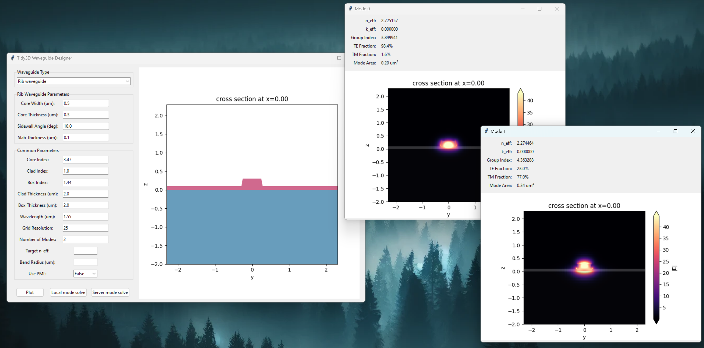

# Tidy3D Mode Explorer

A simplistic graphical user interface for exploring optical waveguide modes using [Tidy3D](https://www.flexcompute.com/tidy3d/solver/)'s waveguide plugin and mode solver. It provides two mode solve options: local mode solve and server mode solve. Local mode solve runs on your local machine, which doesn't require a tidy3d account and is totally free. Local mode solve does not implement the subpixel averaging scheme so the accuracy of the mode data is not guaranteed. Server mode solve sends the mode solve request to a [Flexcompute](https://www.flexcompute.com/) server, which requires a tidy3d account (sign up for a free account [here](https://www.flexcompute.com/)) and a small amount of FlexCredits. When more accurate mode data is needed, server mode solve is recommended.



### Demo Video
[Watch the demo video on Vimeo](https://vimeo.com/1037061805)

## Description

This tool provides an interactive interface for quickly analyzing and visualizing optical waveguide modes using the Tidy3D electromagnetic simulation framework. The GUI supports:

### Waveguide Types
- Strip waveguide
- Rib waveguide
- Slot waveguide

### Key Features
- Interactive parameter adjustment for each waveguide type
- Real-time visualization of waveguide geometry
- Support for both straight and bent waveguides
- Configurable material properties (core, cladding, and box layer indices). Currently only limit to lossless materials.
- Adjustable simulation parameters:
  - Wavelength
  - Grid resolution (minimum steps per wavelength)
  - Number of modes to solve
  - Target effective index (optional)
  - Bend radius (optional)
  - PML (Perfectly Matched Layer) boundaries (optional)

### Parameters
- **Geometric Parameters**:
  - Core width and thickness
  - Sidewall angle
  - Slab thickness (for rib waveguides)
  - Slot gap (for slot waveguides)
  - Cladding and box layer thicknesses

- **Material Parameters**:
  - Core refractive index
  - Cladding refractive index
  - Box layer refractive index

- **Simulation Settings**:
  - Grid resolution
  - Number of modes
  - Target effective index
  - Bend radius
  - PML boundaries

## Installation

1. Clone this repository:
```bash
git clone https://github.com/yourusername/tidy3d-mode-explorer.git
cd tidy3d-mode-explorer
```

2. Install the required dependencies (only `tidy3d` is required):
```bash
pip install -r requirements.txt
```

or simply install `tidy3d` by:
```bash
pip install tidy3d
```

## Usage

Run the GUI application:
```bash
python waveguide_gui.py
```

To use server mode solve, you need to configure your tidy3d API key, unless you have done so previously, by following the instructions in the [Tidy3D documentation](https://docs.flexcompute.com/projects/tidy3d/en/latest/install.html).

## Limitations

This tool is designed to be minimalistic and focuses on basic waveguide mode solving. Current limitations include:

1. Material properties:
   - Only real refractive indices are supported
   - Materials must be isotropic
2. Simulation constraints:
   - Mode solving at a single wavelength only
   - Cannot include substrate or more complex geometries and configurations

For more advanced functionalities, please use the [Tidy3D web GUI](https://tidy3d.simulation.cloud) or [Python API](https://www.flexcompute.com/tidy3d/examples/notebooks/ModeSolver/) directly.

## License

This project is licensed under the MIT License.
